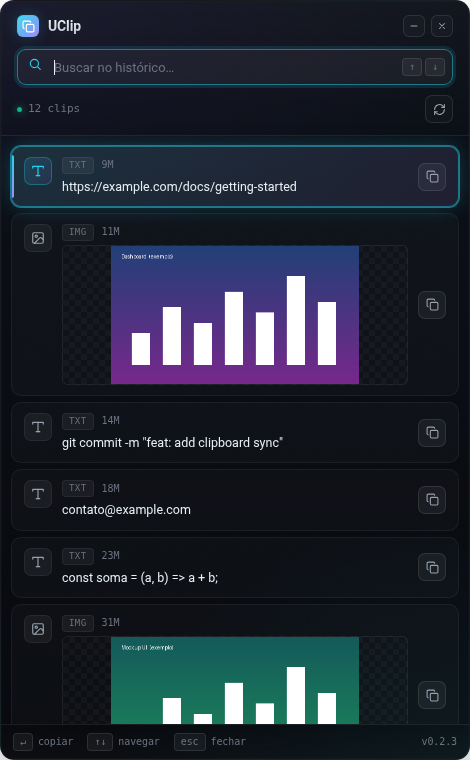
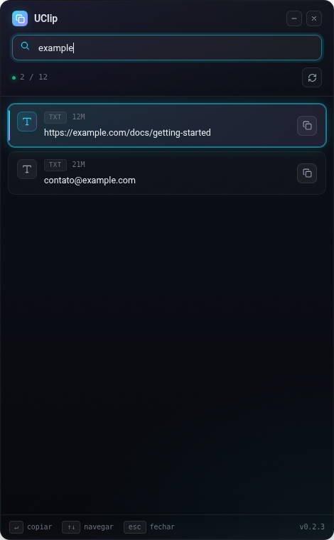

<div align="center">

# 📋 UClip

**Gerenciador de área de transferência moderno para Linux.**
Guarda tudo o que você copia — textos e imagens — e traz de volta com um atalho global (`Super + V`).

[](https://github.com/Jonatas-Serra/UClip/releases)
[](https://github.com/Jonatas-Serra/UClip/releases)
[](LICENSE)
[](#-instala%C3%A7%C3%A3o)
[](#-como-funciona)



</div>

---

## ✨ O que ele faz

- 🔤 **Captura texto e imagens** automaticamente ao copiar (`Ctrl + C` / print de tela)
- ⌨️ **Atalho global `Super + V`** para abrir o histórico de qualquer lugar
- 🔎 **Busca instantânea** no histórico enquanto você digita
- 🖼️ **Miniaturas de imagens** direto na lista
- 📋 **Copiar com um clique** (ou `Enter`) — volta pra área de transferência na hora
- 🗂️ **Histórico persistente** em banco SQLite local, só seu — nada vai pra nuvem
- 🐧 **Funciona em X11 e Wayland** (usa `xclip`/`xsel`/`wl-clipboard`)
- 🇧🇷 **Interface em Português e Inglês**

<div align="center">

<br><sub>Busca filtrando o histórico em tempo real (dados de exemplo).</sub>
</div>

---

## 📦 Instalação

### Ubuntu / Debian / Linux Mint / Pop!_OS

**Última versão em um comando:**

```bash
URL=$(curl -s https://api.github.com/repos/Jonatas-Serra/UClip/releases/latest \
  | grep browser_download_url | grep '\.deb' | cut -d '"' -f4)
wget -O /tmp/UClip.deb "$URL" && sudo apt install -y /tmp/UClip.deb
```

**Ou baixando uma versão específica:**

```bash
VERSION=0.2.3
wget https://github.com/Jonatas-Serra/UClip/releases/download/v${VERSION}/UClip-${VERSION}.deb
sudo apt install -y ./UClip-${VERSION}.deb
```

Também disponível como **AppImage** (portável) na [página de releases](https://github.com/Jonatas-Serra/UClip/releases).

O `.deb` configura tudo automaticamente:

- ✔️ App instalado em `/opt/UClip`
- ✔️ Dependências Python num virtualenv isolado
- ✔️ Serviços de usuário (systemd): `uclip-backend` (API) + `uclip-listener` (captura)
- ✔️ Atalho `Super + V` registrado via `gsettings` (GNOME)
- ✔️ Dados guardados em `~/.local/share/uclip`

Depois de instalar, pressione **`Super + V`** — ou rode `uclip` — e comece a copiar. 🎉

---

## 🚀 Como usar

| Ação | Atalho |
|------|--------|
| Abrir / fechar o histórico | `Super + V` |
| Navegar pelos clips | `↑` / `↓` |
| Copiar o clip selecionado | `Enter` |
| Buscar | é só começar a digitar |
| Fechar | `Esc` |

Copie qualquer coisa (texto ou imagem) normalmente — o UClip guarda no histórico. Quando precisar de algo que copiou antes, `Super + V`, acha e `Enter`.

---

## 🩺 Verificar / solucionar problemas

```bash
# serviços rodando? (são serviços de USUÁRIO, note o --user)
systemctl --user status uclip-backend.service uclip-listener.service

# a API responde?
curl http://127.0.0.1:8001/health        # -> {"status":"healthy"}

# logs em tempo real
journalctl --user -u uclip-listener.service -f
```

| Problema | Solução |
|----------|---------|
| Nada é capturado | Confirme que os serviços estão `active` (comando acima) |
| `Super + V` não abre | Em GNOME/Wayland, faça logout/login após instalar |
| AppImage não abre | `sudo apt install -y libfuse2` |
| "database locked" | Feche outra instância do UClip |

> A qualquer momento você pode desinstalar com o script [`uninstall-uclip.sh`](uninstall-uclip.sh) do repositório.

---

## 🧩 Como funciona

UClip tem duas partes que rodam na sua sessão como serviços de usuário:

```
   você copia (Ctrl+C / print)
            │
            ▼
┌───────────────────────────┐        ┌───────────────────────────┐
│  Listener (Python)        │  grava │  SQLite ~/.local/share/    │
│  xclip / xsel / wl-paste  ├───────▶│  uclip/uclip.db + images/  │
└───────────────────────────┘        └─────────────┬─────────────┘
                                                    │ lê
┌───────────────────────────┐   HTTP :8001   ┌──────▼─────────────┐
│  UI (Electron + React)    │◀──────────────▶│  API (FastAPI)     │
│  atalho Super+V, busca    │                │  /api/clips        │
└───────────────────────────┘                └────────────────────┘
```

- **Backend:** Python, FastAPI, SQLAlchemy, Pillow, pyperclip
- **Frontend:** Electron + React + TypeScript (Vite), CSS próprio (sem framework de UI)
- **Privacidade:** tudo fica local, em `~/.local/share/uclip`. A API escuta só em `127.0.0.1`.

---

## 🛠️ Desenvolvimento

```bash
git clone https://github.com/Jonatas-Serra/UClip.git
cd UClip

# Backend (Python + FastAPI)
python3 -m venv .venv && source .venv/bin/activate
pip install -r backend/requirements.txt
python3 backend/cli/run_api.py        # API em http://127.0.0.1:8001
python3 backend/cli/run_listener.py   # listener de clipboard (outro terminal)

# Frontend (React + Vite)
cd frontend
npm install
npm run dev                           # dev server em http://localhost:5173
npm run dev:electron                  # abre a janela Electron (outro terminal)
```

Com o dev server no ar, dá pra acompanhar a UI direto no navegador em `localhost:5173` (com hot reload). Para empacotar:

```bash
cd frontend
npm run build && npm run prepack && npx electron-builder --linux deb AppImage
```

Veja o [guia de build](docs/BUILD.md) para detalhes.

---

## 🤝 Contribuindo

Issues e pull requests são bem-vindos! Ideias: mais idiomas, temas, sincronização opcional, melhorias de performance.

- 🐛 Bugs: [abra uma issue](https://github.com/Jonatas-Serra/UClip/issues/new)
- 💬 Dúvidas: [Discussions](https://github.com/Jonatas-Serra/UClip/discussions)

---

## 📄 Licença

[MIT](LICENSE) — livre para usar, modificar e distribuir.

<div align="center">
<sub>Feito para a comunidade Linux 🐧 — se te ajudou, deixe uma ⭐</sub>
</div>
